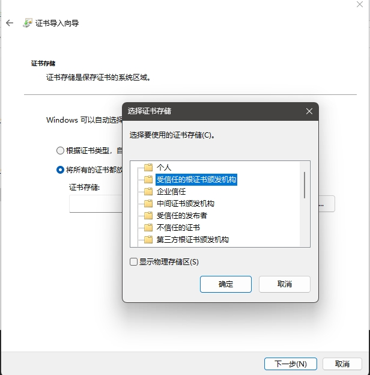
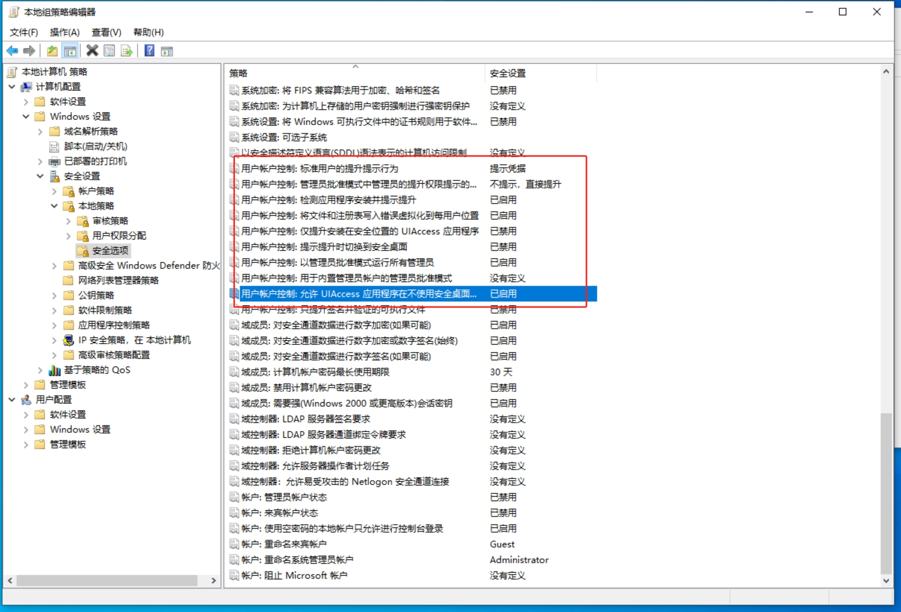

# easy_mouse_cursor

写这个东西主要是为了在hyper-v中能用物理usb鼠标,hyper-v中的虚拟机把系统内置鼠标给隐藏了

The purpose of this tool is to enable the use of a physical USB mouse in Hyper-V. The virtual machines in Hyper-V hide the built-in mouse pointer, allowing clicks but not showing the pointer itself.

需要导入证书才能将窗口'置顶层' 超越右键菜单/任务管理器...

You need to import the certificate to make the window 'topmost' beyond the right-click menu/task manager...

